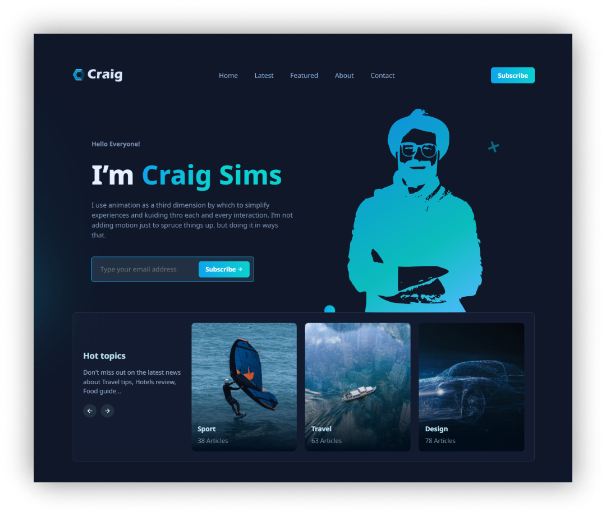

# Sveltekit Strapi Blog



## Project Description

This is a blog website built using Strapi as a headless CMS and Sveltekit as the frontend framework.

<!-- ## Live Demo -->

<!-- ## Source Code -->

<!-- ## Article Link -->
 
## Getting Started

Clone the repo
```bash
git clone https://github.com/Marktawa/sveltekit-strapi-blog
```
Change directory
```bash
cd sveltekit-strapi-blog
```

## Author

[Mark Munyaka](https://markmunyaka.com)

GitHub: [@Marktawa](https://github.com/Marktawa)
Twitter: [@McMunyaka](https://twitter.com/McMunyaka)

## Sponsor

Support my passion for sharing development knowledge by making a donation to my [**Buy Me a Coffee**](https://www.buymeacoffee.com/markmunyaka) account. Your contribution helps me create valuable content and resources. Thank you for your support!

[](https://www.buymeacoffee.com/markmunyaka)

[Buy Me A Coffee](https://www.buymeacoffee.com/markmunyaka)
